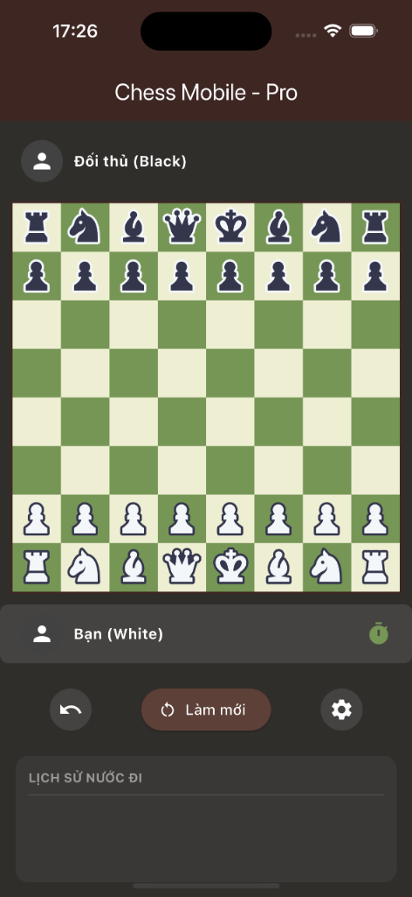

# ♟️ Chess Mobile - Pro

A premium, high-performance chess application built with **Flutter**, designed for a smooth and sophisticated user experience. This project follows clean architecture principles and features modern state management and navigation.



---

## ✨ Features

- **Professional Chess Gameplay**: Full game logic powered by the `chess` package.
- **Premium Aesthetics**: 
  - High-quality **SVG graphics** for all chess pieces.
  - Custom, luxury-styled **King Piece App Icon**.
- **Modern Tech Stack**:
  - **BLoC Pattern**: Scalable and robust state management.
  - **GoRouter**: Clean, declarative navigation.
  - **Service Locator**: Powered by `GetIt` and `Injectable` for dependency injection.
- **Performance Optimized**: Smooth animations and responsive UI across iOS and Android.

---

## 🛠️ Architecture

The project is structured following **Feature-Driven Development** with Clean Architecture:
- `lib/core`: Shared utilities, themes, and base classes.
- `lib/features/chess_game`: Core gameplay module.
  - `data`: Repositories and data sources.
  - `domain`: Entities and business logic.
  - `presentation`: BLoCs, Pages, and Widgets.

---

## 🚀 Getting Started

### Prerequisites

- **FVM** (Flutter Version Management) is recommended but not required.
- Flutter SDK configured in your environment.

### Installation

1.  **Clone the repository**:
    ```bash
    git clone https://github.com/yourusername/chess_game.git
    cd chess_game
    ```

2.  **Install dependencies**:
    Using FVM:
    ```bash
    fvm flutter pub get
    ```
    OR using standard Flutter:
    ```bash
    flutter pub get
    ```

3.  **Run Build Runner**:
    To generate required code (Injectable, etc.):
    ```bash
    fvm flutter pub run build_runner build --delete-conflicting-outputs
    ```

4.  **Launch the App**:
    ```bash
    fvm flutter run
    ```

---

## 🎨 Asset Management

- **App Icon**: Managed via `flutter_launcher_icons`. Source: `assets/images/app_icon.png`.
- **Chess Pieces**: High-resolution SVGs located in `assets/images/chess_pieces/`.

---

## 🤝 Contributing

Contributions are welcome! If you have suggestions or find bugs, please open an issue or submit a pull request.

---
